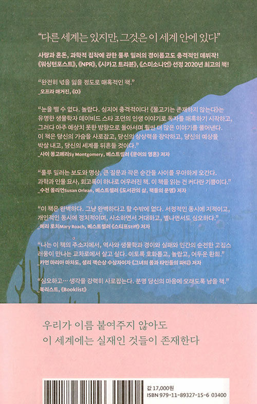

# Overview
팽이와 나뚜의 북커버 다시 만들기 프로젝트!!

좋은 책에는 좋은 북커버가 필요하다.

외국책이 국내에서 번역되어 들어올 때, 국내의 감성(?)에 알맞게 북커버 및 북디자인도 변형된다.

초보 개발자 팽이와 초보 디자이너 나뚜는 **이번 기회에 게임을 그만두고 북커버를 리메이크해보려 한다!!**

## 북디자인 변형의 좋은 예시
[물고기는 존재하지 않는다](https://www.aladin.co.kr/shop/wproduct.aspx?ItemId=284657330)를 예로 들면
### 해외 북커버 - [출처](https://www.simonandschuster.com/books/Why-Fish-Dont-Exist/Lulu-Miller/9781501160349)

### 국내 북커버 - [출처](https://www.aladin.co.kr/shop/wproduct.aspx?ItemId=284657330)

# Document

## Development Environment
pass

## Build and Run

pass

## Manual

pass

# License

MIT Licence

# Contributing

`fora22@naver.com`
- 저작권에 문제가 있다면 삭제하겠습니다. 연락주세요 ㅠㅠ

# Known issues
[이슈](https://github.com/fora22/BookCover_Remake/issues) 참고
